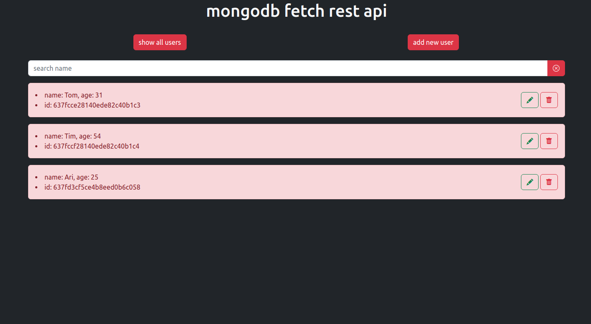

# mongodb-fetch-rest-api



## Application functionality

-   adding new users
-   display of all users
-   deleting users
-   changing user information
-   search for users

### Backend

-   Express
-   Mongodb

### Frontend

-   Webpack
-   Typescript
-   Bootstrap

## Install

Install MongoDB Community Edition or use Mongodb Atlas. Open backend/server.js.
mongodbURL - specify the url for the database.

Open the root folder of the project, use the terminal and execute the command to install node dependencies

```sh
npm install
cd frontend
npm install
```

Server and application start

```sh
npm run start
cd frontend
npm run start
```
